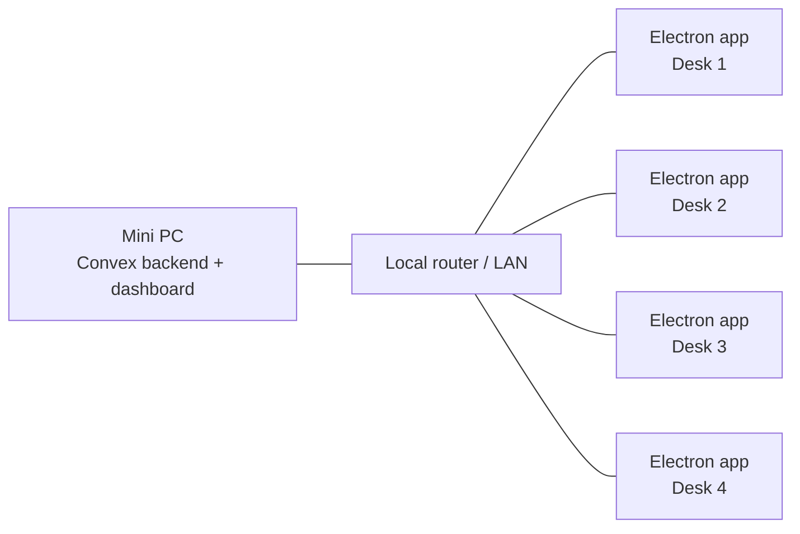

# Lost Property and Amaanat

An offline-first desktop system for running two operational workflows in a remote environment with no internet access:

- `Amaanat` (left luggage): register users, store their items, track storage locations, and print collection receipts.
- `Lost Property`: log lost items, record found items, and match them together when property is recovered.

## Project Context

This project was built for a department operating in a fully offline location. Instead of relying on a cloud backend, the system is designed to run on a local network:

- A mini PC on site hosts the Convex backend in Docker.
- The mini PC and the department laptops are connected to the same router.
- The Electron app is installed on each laptop.
- Each laptop talks to the backend over the local network by pointing `VITE_CONVEX_URL` at the mini PC's LAN IP address.

That setup keeps the system usable even when there is no internet connection.



## How The System Is Used

### Amaanat (Left Luggage)

- Staff register a visitor and store one or more items.
- Each item is assigned a storage location.
- The Electron app prints a physical receipt using native printer access.
- The receipt includes the desk/computer identity so staff can trace where the transaction was handled.

### Lost Property

- Staff log lost items reported by visitors.
- Staff also record found items handed in or discovered on site.
- Lost and found records can be matched so the department can reunite owners with their property.

## Tech Stack

- `Convex` for the self-hosted backend and data model
- `Docker Compose` for running the backend locally or on the mini PC
- `Electron + React + TypeScript + Vite` for the desktop client
- Native Electron printing for receipt output on each workstation

## Repository Layout

- [`convex/`](./convex) contains the Convex schema, queries, and mutations
- [`src/`](./src) contains the React renderer application
- [`electron/`](./electron) contains the Electron main process, preload code, and native printing logic
- [`docker-compose.yml`](./docker-compose.yml) starts the self-hosted Convex backend and dashboard

## Getting Started

### Prerequisites

- Docker Desktop (or Docker Engine with Compose) running on your machine
- Node.js and `pnpm`

### 1. Start the Convex backend

Run:

```bash
docker compose up -d
```

This starts:

- Convex backend API on `http://127.0.0.1:3210`
- Convex site/actions proxy on `http://127.0.0.1:3211`
- Convex dashboard on `http://127.0.0.1:6791`

Backend data is persisted in [`convex-data/`](./convex-data).

### 2. Configure environment variables

Use the example file as your starting point:

```bash
cp .env.example .env.local
```

For local development on the same machine as Docker, keep:

```env
VITE_CONVEX_URL=http://127.0.0.1:3210
```

For a real on-site LAN deployment, change that URL to the mini PC's local network IP, for example:

```env
VITE_CONVEX_URL=http://192.168.1.100:3210
```

If you also need self-hosted Convex admin/CLI access, copy the same example file to `.env` and set `CONVEX_SELF_HOSTED_ADMIN_KEY` after generating it.

To generate a Convex admin key:

```bash
docker compose exec backend ./generate_admin_key.sh
```

### 3. Install frontend dependencies

Run:

```bash
pnpm install
```

### 4. Start the Electron app in development

Run:

```bash
pnpm dev
```

This starts the Vite dev server and launches the Electron application.

## Packaging The Desktop App

To build and package the Electron app:

```bash
pnpm build
```

Build output is written to [`release/`](./release).

## Workstation Setup Notes

On first launch, each workstation is prompted to set:

- a computer name
- a printer name

Those settings are stored locally on that machine and are used when printing Amaanat receipts. This is important in a multi-desk setup because it lets staff identify which workstation handled a transaction.

## Ports

| Service                   | Port   | Purpose                                        |
| ------------------------- | ------ | ---------------------------------------------- |
| Convex backend API        | `3210` | Main backend endpoint used by the Electron app |
| Convex site/actions proxy | `3211` | Self-hosted Convex site/actions endpoint       |
| Convex dashboard          | `6791` | Local admin dashboard                          |

## Notes For Reviewers

This repository showcases both sides of the system:

- a self-hosted Convex backend designed for an offline LAN deployment
- an Electron desktop frontend used by staff across multiple laptops

The important design constraint is that the software must continue working in a remote environment without internet access, while still supporting multiple desks and native receipt printing.
